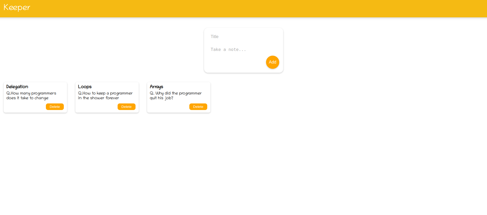

# <a href="https://a07k.github.io/Project-Weather_App/">Keeper Note App</a>

   

   <h2>Description</h2>
    
React Keeper is a simple note-taking application built with React. It allows users to create, view, and delete notes easily.

  <h2>Features</h2>
    <ul>
        <li>Create new notes with a title and content</li>
        <li>View all created notes</li>
        <li>Delete notes</li>
        <li>Responsive design</li>
    </ul>
    <h2>Technologies Used</h2>
    <ul>
        <li>React</li>
        <li>JavaScript (ES6+)</li>
        <li>HTML5</li>
        <li>CSS3</li>
    </ul>
    <h2>Installation</h2>
    <ol>
        <li>Clone the repository:
            <pre><code>git clone https://github.com/your-username/react-keeper-app.git</code></pre>
        </li>
        <li>Navigate to the project directory:
            <pre><code>cd react-keeper-app</code></pre>
        </li>
        <li>Install dependencies:
            <pre><code>npm install</code></pre>
        </li>
        <li>Start the development server:
            <pre><code>npm start</code></pre>
        </li>
        <li>Open <a href="http://localhost:3000">http://localhost:3000</a> in your browser to view the app.</li>
    </ol>

   <h2>Usage</h2>
    <ol>
        <li>To add a new note, fill in the title and content in the form at the top of the page and click "Add".</li>
        <li>Your new note will appear below the form.</li>
        <li>To delete a note, click the delete button on the note you wish to remove.</li>
    </ol>
    <h2>Components</h2>
    <ul>
        <li><strong>App.js:</strong> The main component that manages the state of notes and renders other components.</li>
        <li><strong>CreateArea.js:</strong> A form component for creating new notes.</li>
        <li><strong>Note.js:</strong> A component that displays an individual note.</li>
        <li><strong>Header.js:</strong> The app's header component.</li>
        <li><strong>Footer.js:</strong> The app's footer component.</li>
    </ul>
    <h2>Future Improvements</h2>
    <ul>
        <li>Add data persistence using local storage or a backend database</li>
        <li>Implement note editing functionality</li>
        <li>Add user authentication</li>
        <li>Improve styling and add animations</li>
    </ul>

   <h2>Contributing</h2>
    
Contributions are welcome! Please feel free to submit a Pull Request.

